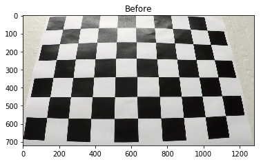
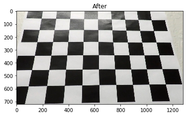
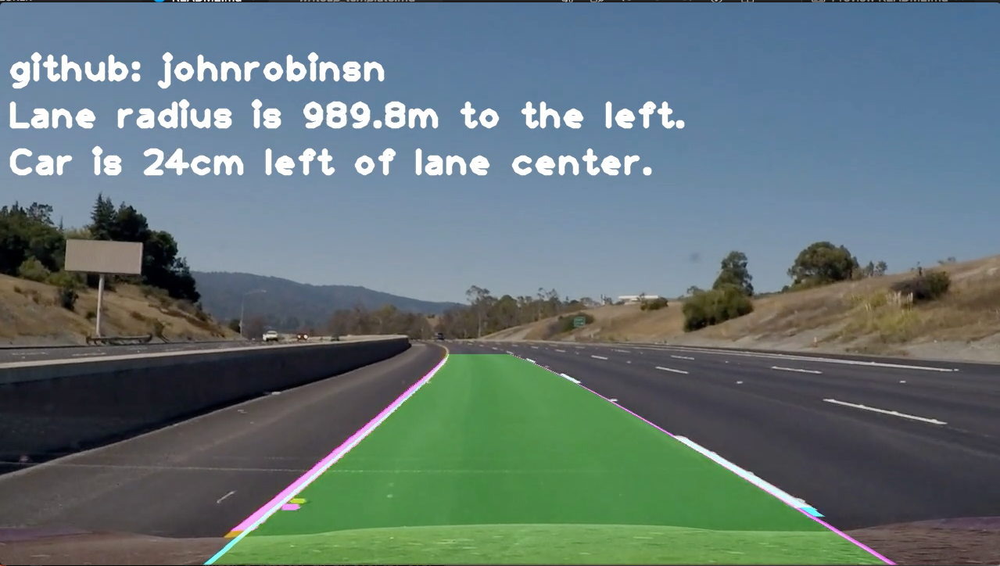
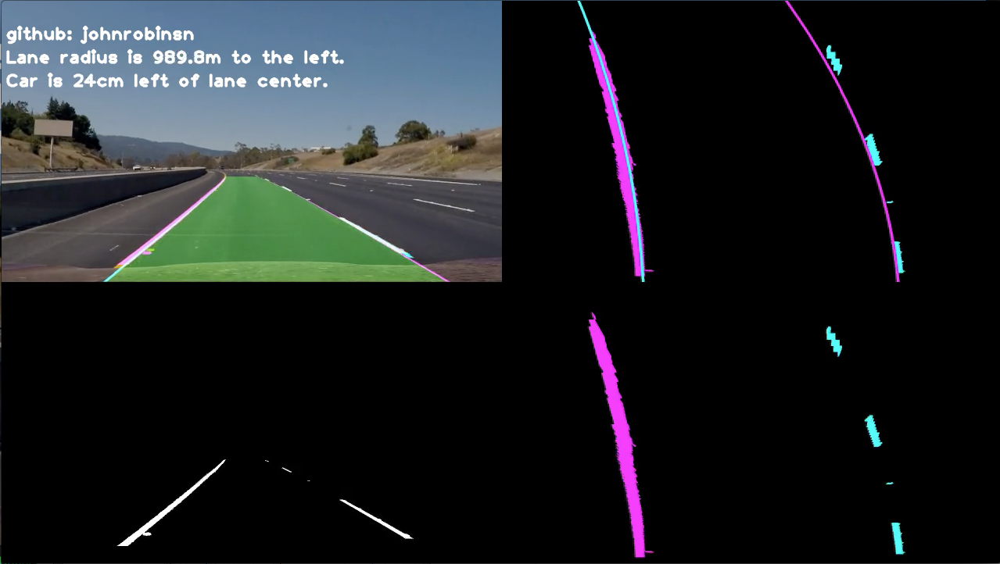

# **Advanced Lane Finding** 
February 1, 2020 - John Robinson

**Project 2** in Udacity’s Self-Driving Car Nanodegree

My Project Repository: https://github.com/johnrobinsn/CarND-Advanced-Lane-Lines

The goals / steps of this project are the following:

* Compute the camera calibration matrix and distortion coefficients given a set of chessboard images.
* Apply a distortion correction to raw images.
* Use color transforms, gradients, etc., to create a thresholded binary image.
* Apply a perspective transform to rectify binary image ("birds-eye view").
* Detect lane pixels and fit to find the lane boundary.
* Determine the curvature of the lane and vehicle position with respect to center.
* Warp the detected lane boundaries back onto the original image.
* Output visual display of the lane boundaries and numerical estimation of lane curvature and vehicle position.

Project Rubric: https://review.udacity.com/#!/rubrics/1966/view
    
My Project Writeup: https://github.com/johnrobinsn/CarND-Advanced-Lane-Lines/README.md

My Jupyter Notebook: https://github.com/johnrobinsn/CarND-Advanced-Lane-Lines/p2_advanced_lane_finding.ipynb

More about the nanodegree program: https://www.udacity.com/drive

## Camera Calibration
Lenses on cameras can introduce image abberations especially near the edges of the lenses.  Some of the more common image distortions that can be observed are "bowing" or "pin-cushion" effects.  Using some numerical analysis and a set of reference images, we can correct for some of these distortions.  We can use a series of "chessboard" images taken with the same camera/lens combination.  Assuming these images are of the same chessboard with the same known number of interior corners, we can calculate a transformation matrix and a set of distortion coefficients that can be used to correct other images.

Here is an example of a chessboard image with 9x6 interior corners.

The code used to calibrate the camera can be found in the utility function, calibrateCameraFromImages in my jupyter notebook.  This function takes a "wild-card" path to a collection of such chessboard images and the number of interior corners in the x and y directions and returns the matrix and distortion coefficients.

Once we have the matrix and distortion coefficients, we can then use these along with the OpenCV function, undistort, to correct other images taken by the same camera.

Here is a **before/after** example.

Before Correction

After Correction

As you can see the "pincushioning" that can clearly be observed in the _before_ image has been largely corrected in the _after_ image, the lines are noticably straighter.

## Pipeline

My main lane finding code can be found in the function, show_lines in the project notebook.  

The pipeline begins by using the OpenCV function, undistort to correct the images taken from the camera, using the matrix and distortion coefficients calculated earlier in the notebook.  

The corrected image is then converted to a black-and-white image that tries to isolate and preserve lane lines as much as possible using colorspace and color gradient analysis.  I use the HSL color space to help identify yellow lane lines and other threshold filters.  This can be found in the call to the binarize_image function.

The pixels that are unlikely to contain lane lines are clipped out by using an isoceles trapezoidal polygon shape.  This can be found in the call to the region_of_interest function.

A perspective transform is then performed on the image to "rectifiy" the image into a "birds-eye view" which tranforms the lane lines as though you are looking straight down on them rather than looking at them out in the distance.  This can be found in the call to the warp function.

Given the "birds-eye view" of the lane lines, we then use the find_lane_pixels function to try to identify likely lane lines by running a histogram on the left and right bottom halves of the image.  This assumes that the lanes are most strongly defined near the bottom of the image (closest to the car).  Then starting from the bottom, the algorithm works its way up the image using a series of sliding windows to identify the pixels that most likely contribute to each lane line using the average horizontal position of the pixels within each window.

Once the pixels for the left lane line and the right lane line have been identified, we can then use the numpy polyfit function to calculate a curve that best fits the lane pixels given least squares error.  

Now that we have curves that define each lane line, we can do a bit of outlier elimination by making a few assumptions.

* Lane lines should not cross within the bounds of the screen.  
* Lane lines should curve in the same direction.
* Lane lines should not exceed a certain maximum curvature.

The code for eliminating lane lines that fail to pass these criteria can be found in the notebook by searching for the comment "filter out some outliers...".

__Note: In order to smooth out changes to the calculated curve from frame to frame, the curves taken from the last ten frames are averaged together.__

Once we have the curves that estimate the lane lines, we can render these to an overlay and reverse the perspective transformation that was performed earlier and render the lane lines back onto the original video frame.

We also convert the curves back into real world coordinate space with an estimated number of pixels per meter in both the x and y direction.  This allows us to calculated the radius of the curve in real world coordinates which I display in an overlay over the video.  The radius of the curve is displayed along with whether it curves to the right or to the left.  The relative position of the car in the lane is also calculated and displayed.  To see the code for this, please search for the comment, "render lane metrics".  

An example of what the rendered frame looks like with the lane overlays and the curve metrics displayed is shown below:

In developing the lane finder, the ability to generate some additional diagnostic views of the pipeline were added.  If the optional argument, show_diag=True is added to the show_lines function call, the generated image will be divided into 4 views.  The upper left view shows the final result of the pipeline.  The lower left view shows the original image after being binarized.  The lower right view shows a birds-eye view of the binarized image rendered with the pixels for the left lane in magenta and the pixels for the right lane rendered in cyan.  The upper right view shows a birds-eye view of the lane pixels along with the calculated lane curves rendered.  The diagnostic view looks like this.

This was very useful in tracking down unhandled edge cases on a frame by frame basis as it provided some insight into where in the pipeline things were breaking down.

**Note:  One additional optimization that was utilized is that once the lane curves were identified using the find_lane_pixels function.  These curves were used to do a slightly more optimized search for likely lane pixels in subsequent image frames by using the find_lane_pixels_around_poly function.  This function takes the previously calculated left and right lane curves and includes only the pixels within a certain margin of these curves.**

## Final Videos
The pipeline worked quite well on the **project video** and the **challenge video**.  The resulting videos along with _diag versions of each video can be found in the **test_videos_output** directory of the project.  Links to the same videos on Youtube are also given below:

[Project Video on Youtube](https://www.youtube.com/watch?v=0yJuAWYfbD8&feature=youtu.be)

[Project Video with Diagnostics on Youtube](https://www.youtube.com/watch?v=h5tjhFHf0dY&feature=youtu.be)

[Challenge Video on Youtube](https://www.youtube.com/watch?v=mLiCSworfnU&feature=youtu.be)

[Challenge Video with Diagnostics on Youtube](https://www.youtube.com/watch?v=0GiAeNbTgNM&feature=youtu.be)

## Harder Challenge Video
The pipeline didn't fair quite as well on the **Harder Challenge Video**.  Special-case handling was added in an attempt to better handle the more extreme lighting conditions and more extreme lane curvature.  The show_lines has an additional parameter hardest=True that was only used when processing the **Harder Challenge Video**. I'm sure further progress could have been made, but the approach would likely have needed to move well beyond the techniques covered thus far, so moving on for now.  The resulting video along with the _diag version can be found in the test_videos_output directory of the project.  Links to the same videos on Youtube are also given below: 

[Harder Challenge Video on Youtube](https://www.youtube.com/watch?v=cdTPbkrXFfI&feature=youtu.be)

[Harder Challenge Video with Diagnostics on Youtube](https://www.youtube.com/watch?v=HPKgD461i7c&feature=youtu.be)

## Summary
This was a challenging project especially given the **Harder Challenge Video**.  The Project Video and the Challenge Video were handled quite well.  But the Harder Challenge Video still shows the fragility of the current pipeline.  Some ways to improve the results would be more dynamic handling of different lighting conditions and applying different thresholds and color spaces when appropriate.  Also the more extreme curvature doesn't allow for the simple culling of background pixels from the processing pipeline.  So a more sophisticated means of subtracting out unnessary background details would be required.  Perhaps some color filtering on vegetation or other techniques might help here.

